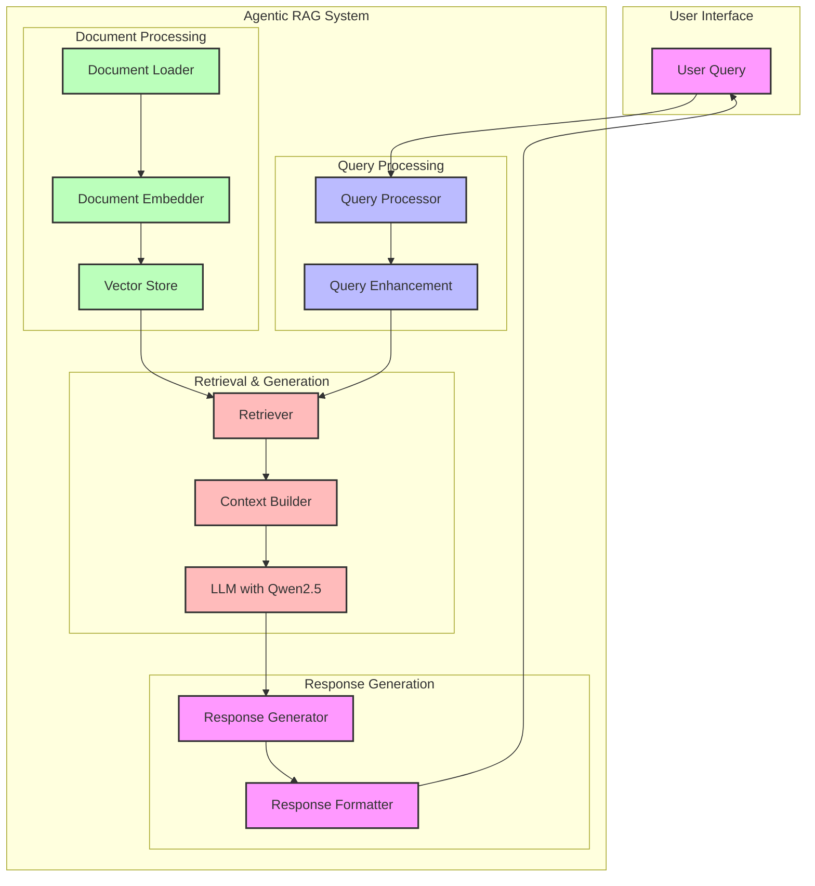

# Agentic RAG

This project is inspired by and borrows heavily from the excellent documentation and examples provided by LlamaIndex. Many of the architectural patterns and implementation details are adapted from their comprehensive guides on building advanced RAG systems.

A powerful RAG (Retrieval-Augmented Generation) system that uses a multi-agent architecture to provide accurate and context-aware responses to queries about documents.

## Overview

This system implements an advanced RAG architecture that combines multiple specialized agents to handle different aspects of document processing and querying. The system is built on top of LlamaIndex and uses Ollama for LLM capabilities.

## Architecture

The system consists of several key components:

### 1. Document Processing
- `DocumentLoader`: Handles loading and preprocessing of documents from a specified directory
- Uses UnstructuredReader to parse various document formats
- Splits documents into manageable chunks for processing

### 2. Agent Architecture
The system implements a hierarchical agent structure:

#### Document Agents
- Each document gets its own specialized agent
- Two types of query engines per document:
  - Vector-based query engine for specific fact retrieval
  - Summary-based query engine for high-level document understanding
- Agents are persisted to disk for efficient reuse

#### Top-Level Agent
- Orchestrates the document agents
- Uses a custom object retriever to find relevant tools
- Implements Cohere reranking for improved result quality
- Provides a unified interface for querying across all documents

### 3. Key Features
- Asynchronous processing for better performance
- Persistent storage of indices and summaries
- Intelligent document summarization
- Multi-level retrieval system
- Tool-based architecture for extensibility

## Usage

1. Place your documents in the `./documents/` directory
2. Run the main script using `python src/agentic_rag.py`

## Contributing

Contributions are welcome! Please feel free to submit a Pull Request.

## License

This project is licensed under the MIT License - see the LICENSE file for details.
