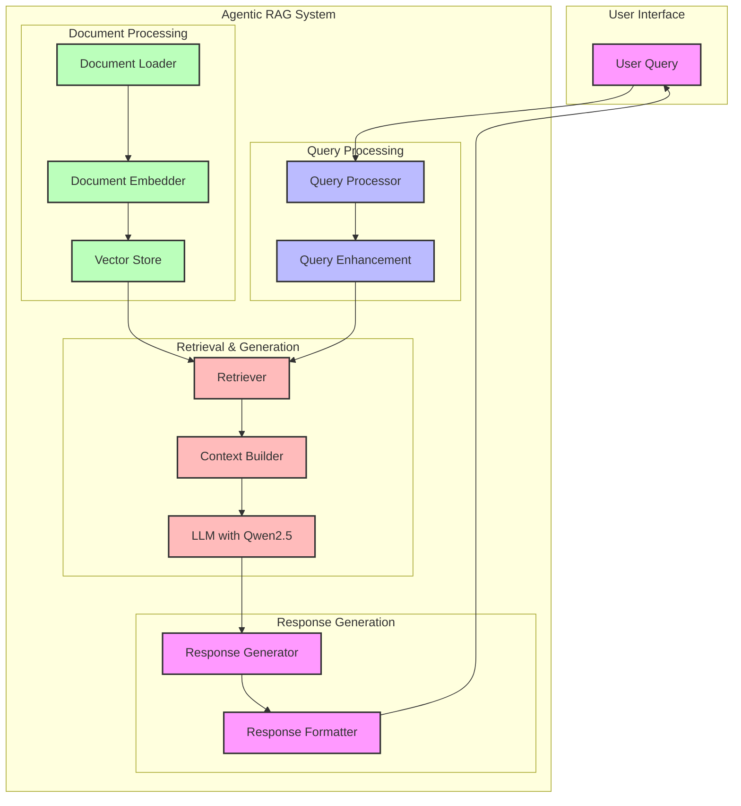

# Web Research Agent System

This is heavilty inspired by the excellent documentation and examples inside the LlamaIndex framework. 
A sophisticated multi-agent system built with LlamaIndex that performs automated web research, analysis, and report generation. The system employs a collaborative workflow of specialized AI agents to produce comprehensive, well-researched reports on any given topic.

## Architecture

The system consists of four specialized agents working in sequence:

1. **Research Planner**
   - Analyzes the research topic
   - Identifies key subtopics
   - Generates search queries
   - Creates report outline

2. **Web Researcher**
   - Executes web searches using Tavily API
   - Gathers relevant information
   - Records and organizes research notes

3. **Report Writer**
   - Structures information into a formal report
   - Formats content in markdown
   - Ensures logical flow and coherence

4. **Quality Reviewer**
   - Reviews report content
   - Provides feedback for improvements
   - Ensures accuracy and completeness

## Prerequisites

- Python 3.8+
- Ollama running locally with Qwen2.5 model
- Tavily API key

## Installation

1. Clone the repository:
```bash
git clone <repository-url>
cd llamaindex_agents
```

2. Install dependencies:
```bash
pip install -r requirements.txt
```

3. Set up environment variables:
```bash
export TAVILY_API_KEY="your-tavily-api-key"
```

## Configuration

The system uses a configuration file (`config.py`) to manage settings:

```python
DEFAULT_MODEL = "qwen2.5:14b-instruct-q4_K_M"
```

## Usage

1. Ensure Ollama is running locally with the Qwen2.5 model:
```bash
ollama run qwen2.5:14b-instruct-q4_K_M
```

2. Run the research workflow:
```bash
python -m src.web_research.agentic_workflow
```

The system will:
- Process the research topic
- Execute web searches
- Generate a comprehensive report
- Provide quality review feedback

## Output

The system provides real-time feedback during execution:
- Agent transitions
- Tool usage and results
- Research progress
- Final report content

## Project Structure

```
web_research/
├── agents/
│   ├── research_planner.py
│   ├── web_researcher.py
│   ├── report_writer.py
│   └── quality_reviewer.py
├── agentic_workflow.py
├── config.py
└── README.md
```

## Contributing

Contributions are welcome! Please feel free to submit a Pull Request.

## License

This project is licensed under the MIT License - see the LICENSE file for details.
