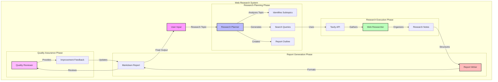

# Web Research System Architecture

## System Components

1. **Research Planner**
   - Input: Research topic from user
   - Output: Structured research plan
   - Responsibilities:
     - Topic analysis
     - Subtopics identification
     - Search query generation
     - Report outline creation

2. **Web Researcher**
   - Input: Search queries from planner
   - Output: Organized research notes
   - Responsibilities:
     - Web search execution via Tavily API
     - Information gathering
     - Research note organization

3. **Report Writer**
   - Input: Research notes
   - Output: Structured markdown report
   - Responsibilities:
     - Content structuring
     - Markdown formatting
     - Logical flow management

4. **Quality Reviewer**
   - Input: Draft report
   - Output: Reviewed and improved report
   - Responsibilities:
     - Content review
     - Feedback generation
     - Accuracy verification

## Data Flow

1. User provides research topic
2. Research Planner creates structured plan
3. Web Researcher gathers information
4. Report Writer creates initial report
5. Quality Reviewer improves report
6. Final report delivered to user

## External Dependencies

- **Ollama**: Local LLM service running Qwen2.5 model
- **Tavily API**: Web search service for research 